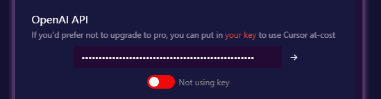

## 1. Cursorのプランとできること
Cursorの基本の料金体系は以下の通りです。

| プラン | 料金 | GPT-4（Slow） | GPT-4（Fast） | GPT-3.5 |
|:------|:----|:------------|:------------|:-------|
| Basic  | 無料 | 50回の使用   | -            | 200回の使用 |
| Pro    | 月額20ドル（年間契約で月16ドル） | 無制限 | 500回の使用 | 無制限 |
| Business | 月額40ドル/ユーザー | 無制限 | 無制限 | 無制限 |

本演習ではBasicプランを利用しますが、GPT-4の利用はSlowであり、50回の制限があるため、OpenAIが発行したAPIキーを設定することでGPT-4を利用する方法を採用します。APIキーは担当者から発行されたものを入手し、下記「[5. CursorへのAPIキーの設定](#5-CursorへのAPIキーの設定)」のとおり適用ください。配布したAPIキーは演習後１週間は有効ですが、その後無効化されますのでご了承ください。

## 2. Cursorのインストール
記事「[Cursorエディタをインストールしよう！](https://zenn.dev/collabostyle/articles/1fed55eb0ab3cd)」を参考にインストールと日本語化を行います。

1. [インストール](https://zenn.dev/collabostyle/articles/1fed55eb0ab3cd#%E3%82%A4%E3%83%B3%E3%82%B9%E3%83%88%E3%83%BC%E3%83%AB)
    
    操作するPCのOSに従いインストーラをダウンロードしてインストールします。Cursorへのユーザ登録とログインも忘れないようにしてください。

2. [日本語設定](https://zenn.dev/collabostyle/articles/1fed55eb0ab3cd#%E6%97%A5%E6%9C%AC%E8%AA%9E%E8%A8%AD%E5%AE%9A%E3%81%AB%E3%81%A4%E3%81%84%E3%81%A6) 

    デフォルトはCursorエディタのメニューや文言が英語なので日本語環境をダウンロードして設定すると使いやすくなるでしょう。英語に抵抗がない場合はそのままでいいでしょう。

## 3. Cursorの環境設定
記事「[Cursorの環境設定について解説！](https://www.creationline.com/tech-blog/68729)」を参考にCursorの環境設定を行うとよいです。設定項目には以下のものがあります。

| 設定項目 | 説明 |
|:--------|:----|
| Account | 有料プランへの移行や有料プランの解約を行うことができます。「Upgrade to Pro」をクリックするとクレジットカード登録画面となり 有料版(Pro) に直ぐに変更可能です。 |
| Docs    | サードパーティライブラリのドキュメントをAIに読み込ませる機能です。チャットの中で設定されたドキュメントを読んでそれに応じた回答をしてくれます。 |
| VSCode Import | VSCodeから移行する場合の設定ファイルのインポート |
| OpenAI API | OpenAIのAPIキーの設定、Cursorへ課金することなくGPT-4など有料モデルが利用できます。 |
| Privacy mode | プライバシーモードを有効にするとCursorによってコードが保存されることがなくなります。 |
| Advanced - Azure API | CursorからAzure OpenAIを利用したい場合に設定を行います。 |
| Advanced - Chat/Edit Tooltip | チャットや編集画面で次のコードや言葉を予測して表示するツールチップを表示するか否かを設定します。 | 
| Terminal Tooltip | ターミナルで次のコマンドや言葉を予測して表示するツールチップを表示するか否かを設定します。 |

## 4. CursorでのOpenAI APIキーの利用
Cursorでは自分のOpenAIのAPIキーを設定することでAPIの従量課金でGPTの機能を利用することができます。

## 5. CursorへのAPIキーの設定
独自のAPIキーを使用するには、Cursorウィンドウ右上にある  をクリックし、設定画面を開き、OpenAI APIセクションに移動し、APIキーを入力します（APIキーは担当者から発行されたものを入手して適用ください）。次に、その横の矢印ボタン（→）をクリックして、キーを確認します。キーが認証されたら、入力の下にあるスイッチを「Not using key」から「Using key」に切り替えます。こうすることで無料のBasicプランでもGPT-4モデルを利用することができるようになります。

