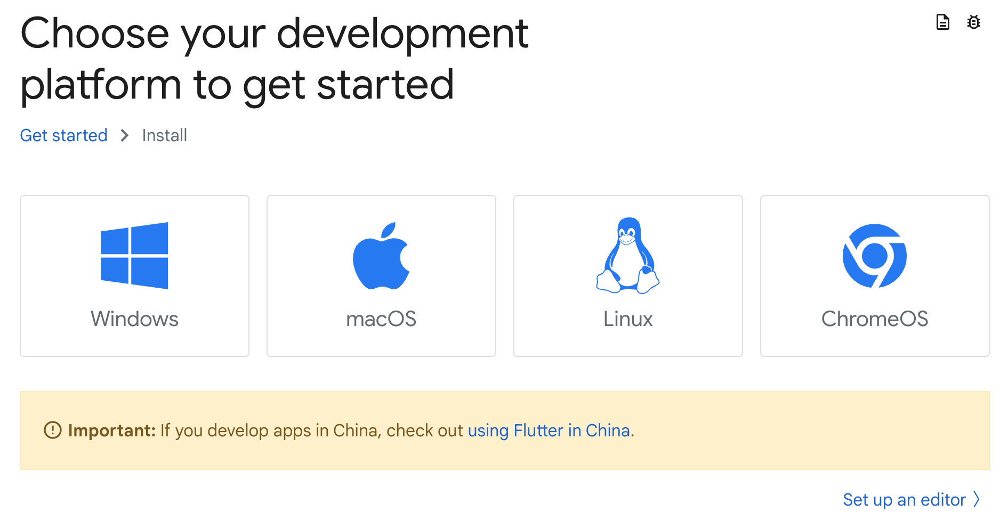
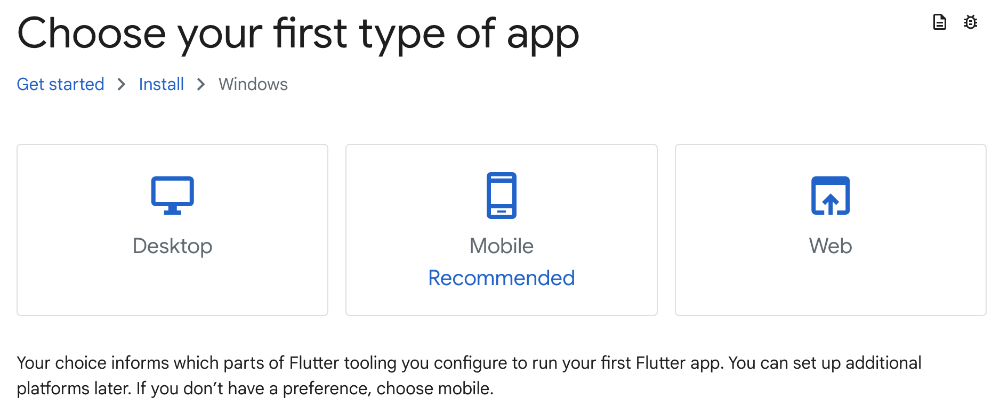

## モバイル開発の課題とFlutter
Flutterはマルチプラットフォームに対応したネイティブアプリやWebアプリをDartと呼ばれる単一の言語で開発できるフレームワークです。顧客や従業員が一人一台スマホを所有するようになった現在では多くの企業がスマホアプリを使ってDXを行うことを望んではいるものの、スマホデバイスのOSや大きさ、開発環境がバラバラで開発者の確保もままならないためその開発と運用がさけられてきました。このような課題がある中、GoogleはFlutterという開発プラットフォームを開発しオープンソースとして公開しています。

## Flutterの特徴1
Flutterは単一のプログラミング言語でコードを一種類実装すれば、iPhone/Androidのスマホアプリとしても、Webアプリとしても、Windows/Mac/Linuxのパソコン用のネイティブアプリとしても同一のユーザインタフェース（画面の大きさが異なるためレスポンシブ/アダプティブデザインで設計する必要はあります）で実行させることができます。そのため、いままではiPhone用かAndroid用か、PC用か、Web用か、など複数の異なる環境ごとに開発を行わなければならなかったものが、単一の開発ですませることができるようになったため、モバイル開発のコストを劇的に抑える可能性がでてきています。

## Flutterの特徴2
デザインの観点からも、マテリアルデザインと呼ばれるGoogleが開発した近代的なデザインシステムをベースにしており、ユーザインタフェースの部品を再利用することが可能です。いままではデザイナーの感性にゆだねていた画面デザインをユニバーサルな言語と方法論を使って構築することができます。

## Flutterの特徴3
また昨今のフロントエンド開発では、バックエンドとはステートレスな形でAPIで連携するUIを採用することが多くなりましたが、FlutterはこのようなUIを構築するためのフレームワークとしても適しています。この場合、アプリ内で編集加工される情報（ステート）はフロントエンド側で状態管理される必要があるため、ステート管理のしくみが重要になってきます。このステート管理の設計には対象のオブジェクト全体として状態遷移を管理するステートパターンやデータ処理部分と表示処理部分を分離するオブザーバーパターンといったデザインパターンを駆使することになりますが、Flutterにはこの状態管理のパッケージが充実しているといった特徴もあります。

## Flutter Webについて
上述の通りFlutterを使えばシングルコードでマルチプラットフォームに対応するアプリが開発できるのですが、開発したコードをコンパイルしアプリとしてリリースする際に問題が生じます。というのも、例えばAndroidの場合はAndroid SDKを同梱したAndroid Studioでコンパイルを行いスマホアプリにデプロイして実行します。iPhoneネイティブアプリを動かすには、開発をWindowsで行うことはできずMac PCが必要です。さらに、XCodeと呼ばれる開発環境に有料の開発アカウントを使ってビルドしなければAppStoreにデプロイしてアプリケーションを公開することすらできません。このようにマルチプラットフォームの開発にはさまざまな開発環境の設定や時にはライセンスの購入が必要になってきます。このような複雑な設定は今回対象外とし、本研修ではFlutterを使ったWebアプリの開発のみにフォーカスします。

## Flutter Webの導入
Flutter Webを導入するには、Flutter SDKのインストールと開発したWebアプリをデバッグするためのChromeのインストールが必要になります。下記にFlutter SDKの導入手順を説明します。

 [Flutterのオフィシャルサイト](https://docs.flutter.dev/get-started/install)からFlutter SDKのインストールを行います。

①プラットフォームを選択します。ここではWindowsを選択します。

②アプリケーションのタイプを選択します。ここではWebを選択します。

③「[Download then install Flutter](https://docs.flutter.dev/get-started/install/windows/web?tab=download#install-the-flutter-sdk)」の手順通りにインストールを行います。

③-1. [Flutter SDKのZIPファイル](https://storage.googleapis.com/flutter_infra_release/releases/stable/windows/flutter_windows_3.16.9-stable.zip)をダウンロードします。

③-2. ダウンロードしたZIPファイルを解凍し、解凍したフォルダを任意の場所（例えばCドライブの直下）に移動します（「C:¥flutter」が作成されます）。

③-3. 環境変数Pathに「C:¥flutter¥bin」を追加します（Cドライブ直下とは異なる場所にflutterフォルダを配置した場合はその場所を指定します）。Windows上での環境変数の設定方法については[こちら](https://www.scc-kk.co.jp/scc-books/java8_workbook/java_dev-win10.html)を参照してください。

## Chromeの導入
Flutter WebをデバッグするためにはChromeが必要になります。Chromeは[こちら](https://www.google.com/intl/ja_jp/chrome/)からダウンロードしてインストールしてください。

## Flutter Webの導入確認
Flutter Webの導入確認はCursorから行います。

1. 設定した環境変数が反映されるようにするため、Cursorを一度閉じて再度立ち上げます。
2. Cursorを開いてメニューの「表示」＞「ターミナル」を選択すると画面中央下部にpowershellのターミナルが表示されます。
3. ターミナルに`flutter doctor`と入力してください。

