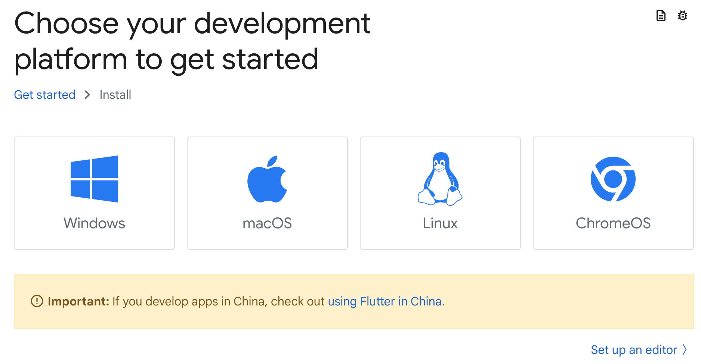
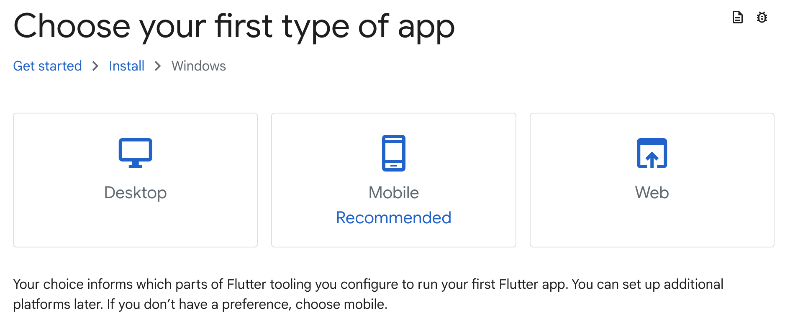

# 1-3. Flutterの環境設定
本研修で利用するFlutter Webの説明と環境設定の方法を説明します。

## 1.Flutter Webの導入
Flutter Webを導入するには、Flutter SDKのインストールと開発したWebアプリをデバッグするためのChromeのインストールが必要になります。下記にFlutter SDKの導入手順を説明します。

 [Flutterのオフィシャルサイト](https://docs.flutter.dev/get-started/install)からFlutter SDKのインストールを行います。

①プラットフォームを選択します。ここではWindowsを選択します。

②アプリケーションのタイプを選択します。ここではWebを選択します。

③「[Download then install Flutter](https://docs.flutter.dev/get-started/install/windows/web?tab=download#install-the-flutter-sdk)」の手順通りにインストールを行います。

③-1. [Flutter SDKのZIPファイル](https://storage.googleapis.com/flutter_infra_release/releases/stable/windows/flutter_windows_3.16.9-stable.zip)をダウンロードします。

③-2. ダウンロードしたZIPファイルを解凍し、解凍したフォルダを任意の場所（例えばCドライブの直下）に移動します（「C:¥flutter」が作成されます）。

③-3. 環境変数Path（「ユーザの環境変数」側に追加ください）に「C:¥flutter¥bin」を手打ちで（コピペだと¥マークがそのまま入力され、Windows側で有効なバックスラッシュになりません）追加します（Cドライブ直下とは異なる場所にflutterフォルダを配置した場合はその場所を指定します）。Windows上での環境変数の設定方法については[こちら](https://www.scc-kk.co.jp/scc-books/java8_workbook/java_dev-win10.html)を参照してください（環境変数を変更した場合は一度Cursorを閉じて再度立ち上げてください）。

## 2.Chromeの導入
Flutter WebをデバッグするためにはChromeが必要になります。Chromeは[こちら](https://www.google.com/intl/ja_jp/chrome/)からダウンロードしてインストールしてください。

## 3.Flutter Webの導入確認
Flutter Webの導入確認はCursorから行います。

1. 設定した環境変数が反映されるようにするため、Cursorを一度閉じて再度立ち上げます。
2. Cursorを開いてメニューの「表示」＞「ターミナル」を選択すると画面中央下部にpowershellのターミナルが表示されます。
3. ターミナルに`flutter doctor`と入力し、「Flutter」と「Chrome」に「[✓]」が表示されていればFlutter SDKが導入され、Web開発が可能になっているということなのでOKです。他のリストには赤色の[x]が表示されるでしょうが問題ありません。

## 4.favappプロジェクトのGit clone
1. Cursorのメニューの「表示」＞「ターミナル」を選択し、画面中央下部にpowershellのターミナルを表示します(すでにターミナルが開いている場合はそれを利用します)。
2. ターミナルで`cd ~`と入力し、ホームディレクトリ「C:¥Users¥[ユーザ名]」に移動してから、`git clone https://github.com/david3080/favapp.git`と入力してfavappプロジェクトをダウンロードします。
3. Cursorのメニューの「ファイル」＞「フォルダーを開く...」を選択し、先ほどダウンロードしたfavappフォルダを選択して開きます。
4. Cursorの右下から「Some packages are missing or out of date, would you like to get them now?」という通知が表示されるので「Run 'pub get'」ボタンをクリックします。通知が表示されない場合は`flutter pub get`と入力して必要なパッケージをダウンロードします。そうすることで必要なパッケージが導入され、プログラムのエラーがなくなります。
5. ターミナルに`flutter run -d chrome`と入力してChromeでfavappプロジェクトを実行します。しばらくするとChromeブラウザが立ち上がって「favappアプリ」が起動します。好みの選択と削除をしてみてどのようにアプリが動くかを確認してみてください。

