# 1-2. マテリアルデザインの基礎
ここでは画面設計に関連して、スマホアプリのUIデザイン、特にマテリアルデザインについて学習します。世の中のスマホといえば、iPhoneとAndroidの2種類ですが、それぞれAppleとGoogleがUIデザインのガイドラインを出しています。iPhoneは[ヒューマン・インタフェース・ガイドライン](https://developer.apple.com/design/human-interface-guidelines/)、Androidでは[マテリアル・デザイン](https://m3.material.io/)です。各ガイドラインの紹介をする前に、スマホアプリ特有の問題からデザインの歴史を説明してから、ヒューマン・インタフェース・ガイドラインとマテリアルデザインの紹介をします。

## 1.スマホの特徴
スマホには、パソコンとは異なる2つの特徴があります。

### 特徴1.画面が小さく操作手段が限定的
スマホは画面が小さくさらにマウスやキーボードがないため操作手段が限定されるため、画面レイアウトや操作方法をどのようにデザインするかでユーザ満足度が大きく変化します。

### 特徴2.画面サイズがばらばら
AndroidとiPhoneという違いだけでなく、同種のスマホでも画面サイズが様々で、アプリのレイアウト幅や高さを固定すると画面表示が崩れて使い物にならなくなります。例えば、歴代のiPhoneを比べても下図のとおり様々な画面サイズが存在しますし、Androidは各デバイス開発会社が様々なものを出しているのでiPhone以上に画面サイズはバラバラです。

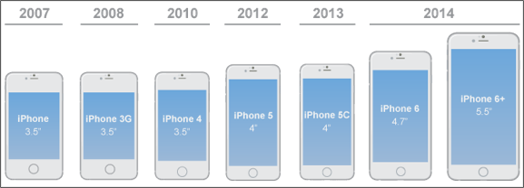

## 2.スマホアプリで発生しやすい問題
Google PlayやApp Storeに登録された実際のアプリの評判からまとめたスマホアプリに対するよくある悪評は主に以下の4つに集約されます。

1. 操作途中でクラッシュしてしまう
2. ナビ機能が不十分で、元の画面に戻れない、探している機能に行き着かない
3. デザインが必要以上に凝っていたり意味不明のため使えない
4. 大量の情報がそのまま表示され、検索したりフィルタリングする機能がない

これらの悪評のうち、1以外の2から4まではUIデザインの問題といえます。

## 3. スマホデザインの歴史
それではスマホにおけるデザインはどのような歴史を歩んできたのでしょうか。

まず、2000年前半のWebやアプリケーションのUIはそれまでのWindowsパソコンが機械的で使いづらく利用者のことを考えて作られていないという反省から、現実世界を模した装飾的なデザインからなるUIを取り入れるようになりました。この考え方によるデザインを[スキューモーフィズム](https://ja.wikipedia.org/wiki/%E3%82%B9%E3%82%AD%E3%83%A5%E3%83%BC%E3%83%A2%E3%83%BC%E3%83%95%E3%82%A3%E3%82%BA%E3%83%A0)と呼びます。ただし、この装飾に凝ったデザインでは、デザイナーの主張が先行し、見た目や操作性に統一感がないといった弊害を生むことになりました。

そのため、20世紀初頭に[モダニズム](https://ja.wikipedia.org/wiki/%E3%83%A2%E3%83%80%E3%83%8B%E3%82%BA%E3%83%A0)が建築や工業製品のデザインに取り入れられたように、パソコンやWebやスマホのデザインにも極力装飾を廃した[フラットデザイン](https://ja.wikipedia.org/wiki/%E3%83%95%E3%83%A9%E3%83%83%E3%83%88%E3%83%87%E3%82%B6%E3%82%A4%E3%83%B3)が採用されることになりました。このフラットデザインを採用しているのがAppleです。AppleはiPhone 7のデザインにフラットデザインを取り入れ、[ヒューマン・インタフェース・ガイドライン](https://developer.apple.com/design/human-interface-guidelines)もそれにのっとったガイドラインを発表しています。

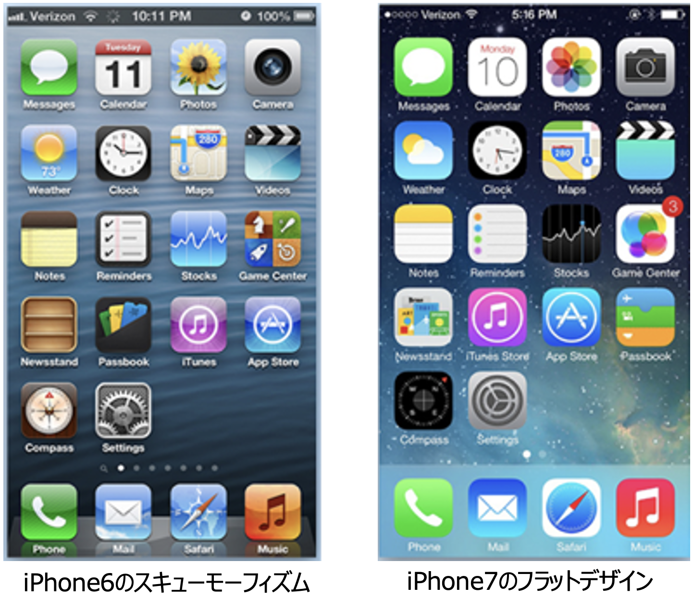

しかし、フラットデザインはシンプルすぎて、システムの構造やしくみが理解しづらいといったデメリットが挙げられます。そこで、Googleはフラットデザインとスキューモフィズムの中間をとり、さらに発展させた「[マテリアル・デザイン](https://m3.material.io/)」を定義し、2014年にだれもが参照して利用できるオープンソースな形でデザインガイドラインを発表しました。

本書では、[ヒューマン・インタフェース・ガイドライン](https://developer.apple.com/design/human-interface-guidelines/)の概要を述べるものの、[マテリアル・デザイン](https://m3.material.io/)をメインに説明します。また、本書で利用している開発プラットフォームであるFlutterもマテリアルデザインを全面的に採用しており、AndroidはもとよりiPhoneでもマテリアルデザインを実装することができるツールであるため、本書においては開発全般でマテリアルデザインを採用しています。

## 4. ヒューマン・インタフェース・ガイドラインとは？
ヒューマン・インタフェース・ガイドラインでは3つのデザインテーマと6つのデザイン原則とその他設計の詳細が記載されていますが、ここでは3つのデザインテーマと6つのデザイン原則を紹介します。

### ①3つのデザインテーマ
iOSアプリは「明確であること」「コンテンツにフォーカスすること」「奥行きがあること」の3つのデザインテーマにのっとってデザインすることを推奨しています。

1. 明確であること
あらゆる画面サイズのスマホデバイスで、テキストは読みやすく、アイコンは明快で、装飾は繊細で適度であり、かつ機能的であることが必要です。空間、色、フォント、グラフィック、インターフェイスに関する各要素は、重要なコンテンツは適度に強調されインタラクティブ性を向上します。

2. コンテンツにフォーカスすること
滑らかな動きと鮮明で美しいインターフェースは、ユーザが操作に迷うことなく、コンテンツを理解して操作するのに役立ちます。通常、コンテンツは背景の上に表示されますが、背景を半透明にするなどの工夫で、より多くのことを示唆します。ベゼル、グラデーション、ドロップシャドウの使用を最小限に抑えながら、コンテンツを最優先に表示することで、インターフェイスを明るくわかりやすくします。

3. 奥行きがあること
明確な視覚的レイヤーとリアルな動きが階層を伝え、画面に活力を与え、ユーザに理解を促進します。接触の間隔と発見のしやすさはユーザに喜びを高め、コンテキストを失うことなく機能と追加コンテンツへのアクセスを可能にします。トランジションは、コンテンツをナビゲートするときに奥行き感を提供します。

### ②6つのデザイン原則
iOSアプリは、ユーザへのインパクトとリーチを最大化するため、アプリのアイデンティティを強化するため、次の原則に従うことを推奨しています。

1. 美的完全性
美的完全性は、アプリの外観と動作がその機能とどれだけうまく統合されているかを表します。たとえば、ユーザが慎重を期す作業をするアプリでは、微妙で目立たないグラフィックと標準的な操作、予測可能な動作を提示することで集中力を維持できます。一方、ゲームなどの没入型アプリでは、発見を促しながら楽しさと興奮を約束する魅力的な外観を提供するとよいでしょう。

2. 一貫性
一貫性のあるアプリはシステムが提供するインターフェース要素とよく知られたアイコン、標準のテキストスタイル、統一された用語を使用することで、使い慣れた標準的な印象を与えます。このようなアプリはユーザが期待する方法で機能と動作を組み込んでいます。

3. 直接的な操作
画面上のコンテンツを操作することで、ユーザを引き付け、理解を促進します。ユーザは、デバイスを回転させたり、ジェスチャーを使用して画面上のコンテンツに影響を与えたりすると、直接的な操作の体験をします。直接的な操作を通じて、自らの行動が即時にアプリに影響を与えることを体験するわけです。

4. フィードバック
フィードバックは行動を認め、結果を示して人々に情報を提供し続けます。組み込みのiOSアプリは、すべてのユーザーアクションに応答して知覚可能なフィードバックを提供します。インタラクティブな要素をタップすると簡単に強調表示され、進行状況インジケーターが長時間実行されている操作のステータスを伝え、アニメーションとサウンドがアクションの結果を明確にするのに役立ちます。

5. メタファー
アプリの仮想オブジェクトとアクションが、現実の世界に根ざしているのかデジタルの世界に根ざしているのかにかかわらず、身近な体験のメタファーである場合、ユーザはより迅速に学習します。ユーザが画面を物理的に操作するため、メタファーはiOSでうまく機能します。ビューを邪魔にならないように移動して、下のコンテンツを公開します。コンテンツをドラッグしてスワイプします。スイッチを切り替えたり、スライダーを移動したり、ピッカーの値をスクロールしたりします。ユーザは本や雑誌のページをめくることさえします。

6. ユーザーコントロール
iOS全体を通して、アプリではなくユーザが制御します。アプリは一連の行動を提案したり、危険な結果について警告したりできますが、アプリは意思決定をしません。最高のアプリは、ユーザーを有効にすることと望ましくない結果を回避することの間の正しいバランスを見つけます。アプリは、インタラクティブな要素を使い慣れた予測可能な状態に保ち、破壊的なアクションを確認し、すでに進行中の場合でも操作を簡単にキャンセルできるようにすることで、ユーザーがアプリをコントロールしているように感じさせることができます。

## 5. マテリアルデザインとは？
一方、マテリアルデザインとは、Googleが2014年に発表したUIのデザインガイドラインです。Googleは、Gmailなどの数多くのアプリを世に出していましたが、それらがパソコン、Android、iPhone、タブレットなど異なるデバイスで利用されるとき、画面サイズもOSも異なるため、異なった見た目と操作性を持ってしまったことを問題視していました。そこで、デバイスが異なっていても、統一したデザインで操作できるようなUIデザインのガイドラインを作る目的で開発されたのがマテリアルデザインです。例えば、スマホのようなデバイス用には、片手で操作することを想定し、直感的で意味のある物理的（マテリアル）な概念をデザインに取り入れてガイドラインが策定されています。また、明示はされていませんが、ユーザ インタフェースという意味では、ヒューマン・インタフェース・ガイドラインで挙げた3つのデザインテーマと6つのデザイン原則は、マテリアルデザインでも目指すところは同じです。

マテリアルデザインは、あくまでもガイドラインであるため、必ず準拠すべきものではありませんが、デザインの部品がどのような形でどのように動くかが細かく規定されており、Java、Kotlin、Swift、JavaScript、Flutterといったさまざまな言語に対応した無料で利用できるプログラムライブラリとともに提供されているため、まるまる採用することで一定レベル以上のUIデザインのアプリを最小のコストで開発することができます。そのため、多くのプロジェクトで採用されるに至っています。

### ①マテリアルデザインの4つの考え方
マテリアルデザインは以下の4つのコンセプトからなりたっています。

#### 1. 形をもった面
形をもったうすい紙のような面が重なって画面を表示するしくみを採用しています。この考え方によって、一枚の紙を切って分割して記事を表示したり、メニューやフッターを表示するための紙と中心のコンテンツをのせるための紙が重なって表示されることを影を使って表現することができます。これによって実際は奥行きがなくフラットなスマホの画面を立体的に表現することによって、表示されているものの種類が区別しやすくなったり、高さを使うことで手前にあるものほど重要といったユーザが3次元の世界で感じるのと同じくどこに注意をむけるべきかを直感的に知らせることができるようになっています。

>[!NOTE]
>指によるタッチや文字入力など人による操作は物理的なルールに従い画面表示に影響を及ぼします。また面は厚さを持つので、同じ奥行きに存在することはなく透過することもない、といった実際の物理的な世界の常識を反映します。このように、マテリアルデザインにおいて面・奥行き・光と影に関しては、下記のルールにのっとって実装されています。
>
>面：現実世界の物理世界をスマホ画面のデザインに反映し、画面に表示される部品は厚さ1dp(ドットポイント)の面で構成されます。
>https://material.io/design/environment/surfaces.html
>
>奥行き：概念的には面が何層にも重なっていて奥行きをもった構造を持っています。
>https://material.io/design/environment/elevation.html
>
>光と影：面と面との奥行きの違いは後ろの面にうつった影によって表現され、手前の面が手前に浮き上がれば影は大きくなります。
>https://material.io/design/environment/light-shadows.html

#### 2. 印刷物のようなデザイン
文字や絵が紙に載っているという概念からなり、ベースラインやキーラインといった印刷物のコンセプトを踏襲しています。ベースラインを決めることでコンテンツが収まる範囲を決めたり、本文やタイトルなどはキーラインを基準に配置するなど、印刷用にワードなどに設定する値などを応用することで、見た目に統一感を持たせて画面を美しくみせます。また見やすいフォントが無料で提供されています。

#### 3. 意味のあるアニメーション
ユーザになんらかの意味を伝えるためにはアニメーションが効果的な場合がありますが、コンポーネントにアニメーション表示を簡単にほどこせるようなしくみを実装しています。

#### 4. アダプティブデザイン
パソコン、Androidスマホ、iPhone、タブレットなどデバイスが異なり画面サイズが異なっていても形を崩さず表示するしくみを実装しています。レスポンシブデザインも同じコンセプトですが、アダプティブデザインは横幅の伸び縮みだけでなく、メニューの表示非表示などを含む、より画面サイズに応じた（アダプティブな）形でデザインを変化させるしくみをそなえています。

### ②Flutterにおけるマテリアルデザイン
マテリアルデザインを使うと下記のようなリッチなUI画面を実装することができます。下記リンクを開くとFlutterを使って実装したUI画面のサンプルギャラリーが参照できます。

Flutterを使って実装したUI画面のサンプルギャラリー

>[!NOTE]
>Flutterチームは、改変可能で商用利用可能なオープンソースライセンスであるBSDライセンスで豊富なデモサンプルをソースコードと一緒に提供しています。
>https://flutter.github.io/samples/#?platform=web

またFlutterでは、下記のようなマテリアルデザインの部品が提供されています。このように画面にのせる部品はたくさん存在しているので、それぞれ何ができるかだけ覚えておいて、画面パターンに従って使う部品を選別してから詳細の実装方法を調べるのがよいでしょう。

※「野菜と果物のお気に入りアプリ」で利用している部品には「⭕️」印をつけています。

#### [アップバー](https://m2.material.io/develop/flutter/components/app-bars-top/) ⭕️
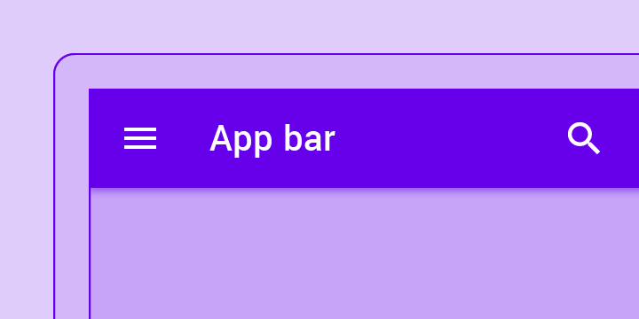

#### [ボトムナビゲーション](https://m2.material.io/develop/flutter/components/bottom-navigation/) ⭕️
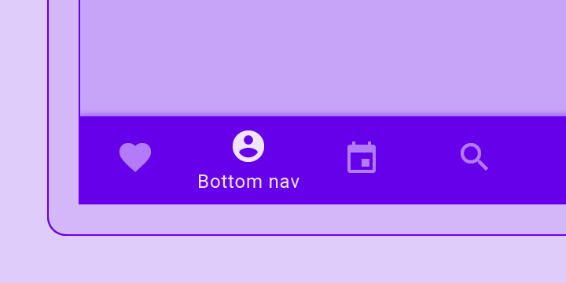

#### [ボタン](https://m2.material.io/develop/flutter/components/buttons/) ⭕️
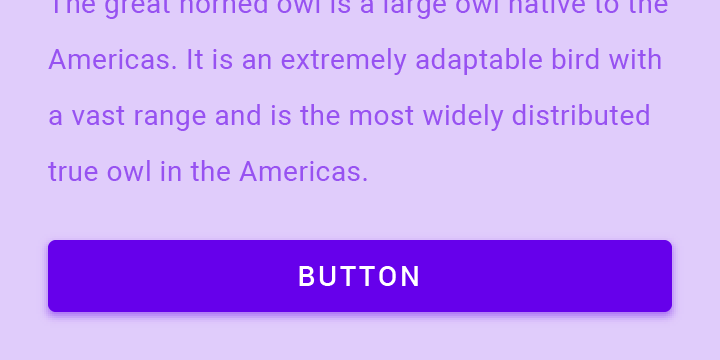

#### [フローティングアクションボタン](https://m2.material.io/develop/flutter/components/floating-action-buttons/) ⭕️

#### [カード](https://m2.material.io/develop/flutter/components/cards/) ⭕️
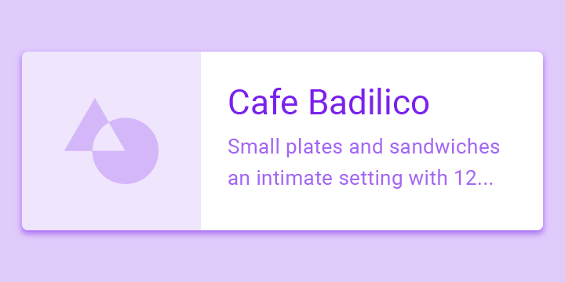

#### [データテーブル](https://m2.material.io/components/data-tables/flutter)
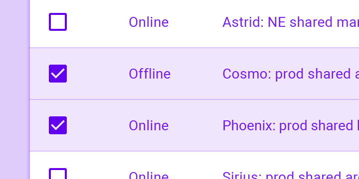

#### [ダイアログ](https://api.flutter.dev/flutter/material/Dialog-class.html) ⭕️
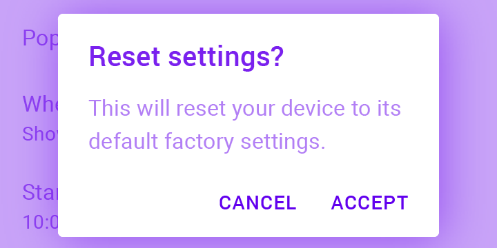

#### [リスト](https://material.io/develop/flutter/components/lists) ⭕️
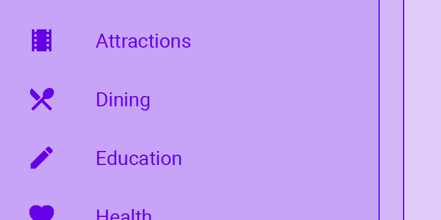

#### [メニュー](https://api.flutter.dev/flutter/material/PopupMenuButton-class.html)
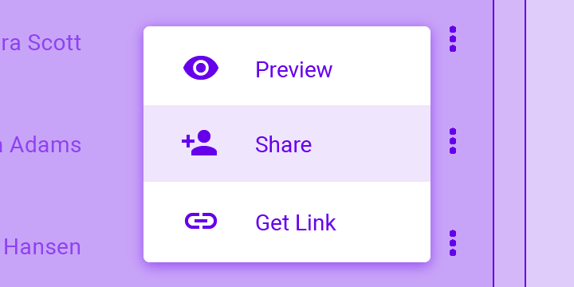

#### [チェックボックス](https://m2.material.io/develop/flutter/components/checkboxes)
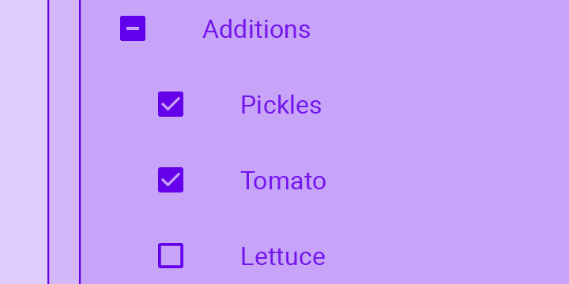

#### [ラジオボタン](https://m2.material.io/develop/flutter/components/radio-buttons/)
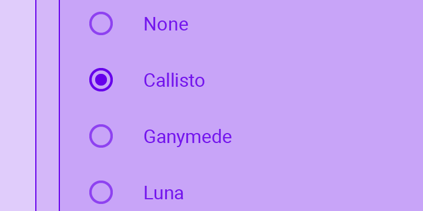

#### [スイッチ](https://api.flutter.dev/flutter/material/Switch-class.html)
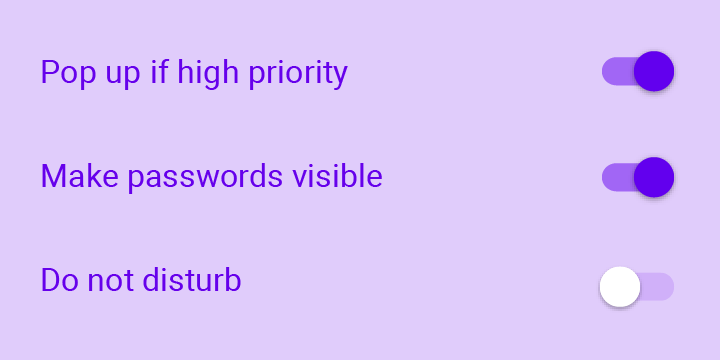

#### [スナックバー](https://m3.material.io/components/snackbar/guidelines) ⭕️
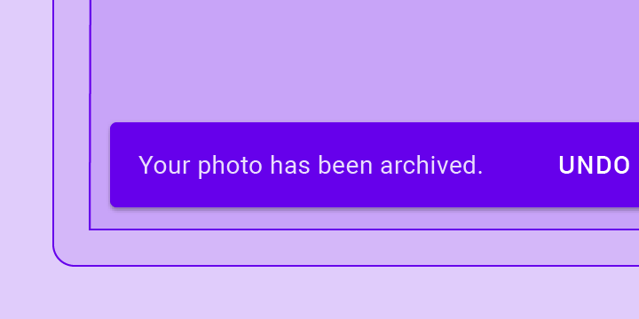

#### [タブ](https://m3.material.io/components/tabs/overview)
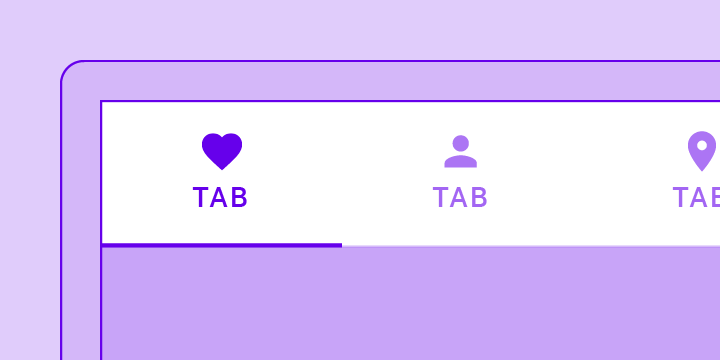

#### [テキストフィールド](https://m3.material.io/components/text-fields/overview)
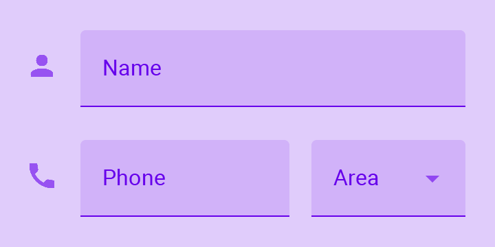

#### [アイコン](https://material.io/resources/icons/) ⭕️
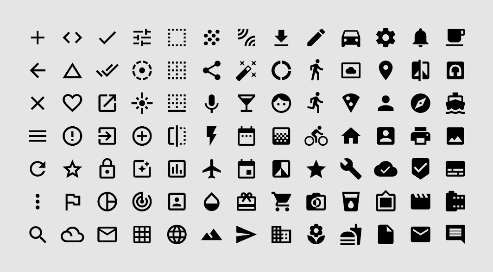

>[!NOTE]
>- マテリアルデザインのコンポーネント詳細については下記URLを参照してください。
>https://material.io/components
>- Flutterにおけるマテリアルデザインについては下記URLを参照してください。
>https://material.io/develop/flutter

### ③カラーテーマ
マテリアルデザインはアプリのブランディングを統一的に進めるためにカラーテーマというしくみを採用し、アプリケーション全体で部品の色やフォントカラーを統一させることが可能です。逆に言うと、同じアプリでもカラーテーマを変えてイメージの異なるアプリとして仕上げることが可能ですので、アプリケーションのテンプレートを先に作っておいて様々なプロジェクトに応用する場合にもこのようなしくみは役に立つでしょう。

- カラーテーマ：https://material.io/design/color/the-color-system.html
- カラーツール：https://material.io/resources/color/

## 6. デザインシステム
通常、アプリケーションの開発プロジェクトでは、事前にマテリアルデザインのようなデザインフレームワークからプロジェクトで活用するレイアウトや部品を選択してカラーテーマやフォントを決めて、アプリのブランドに統一感を持たせることをします。このようなデザイン原則とデザインフレームワークの組み合わせを「デザインシステム」と呼びます。

最近日本国内でも「[みんなの銀行](https://note.minna-no-ginko.com/n/n5990880b26ae)」や「[デジタル庁](https://digital-gov.note.jp/n/n78f6a2f82e48)」でもデザイン原則やシステムデザインを整備してWebサイトを作るといったアプリ開発を行うことがはじまっています。Webサイトといった単純なUIだけならデザインシステムもロゴやカラーデザインや画面テンプレート程度を決めるだけですみますが、スマホアプリのデザインシステムというとより複雑な機能を含みますので、これを一から作るのは大変な労力がかかります。

そのため、本書ではマテリアルデザインをまるまるデザインシステムとして採用してスマホアプリを開発します。サービスのブランディングに関わるロゴやイラスト、カラーデザインをカスタマイズする機能もマテリアルデザインを支えるFlutterのようなツールにも開発が進められていますので、これを使わない手はないでしょう。