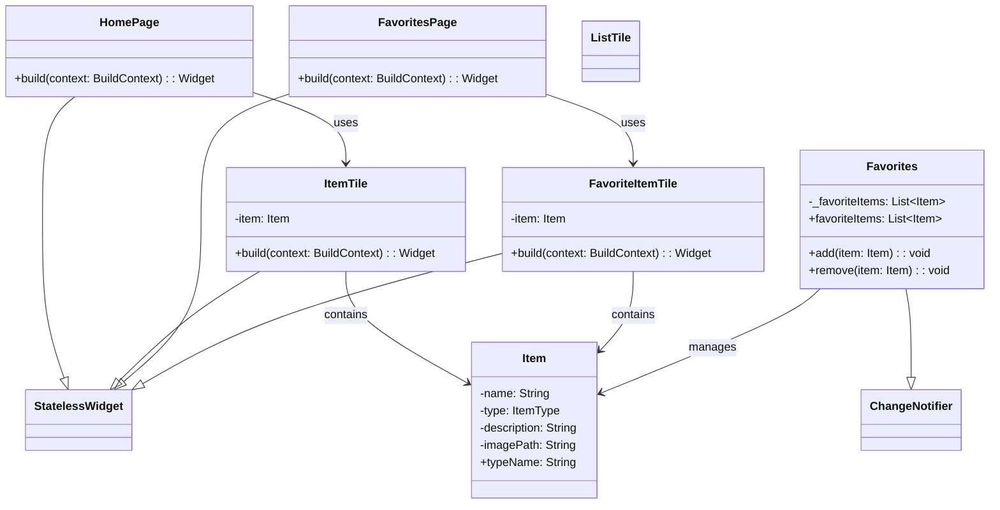

## クラス図

```mermaid
classDiagram
    class HomePage {
        +build(context: BuildContext): Widget
    }
    class ItemTile {
        -item: Item
        +build(context: BuildContext): Widget
    }
    class FavoritesPage {
        +build(context: BuildContext): Widget
    }
    class FavoriteItemTile {
        -item: Item
        +build(context: BuildContext): Widget
    }
    class Favorites {
        -_favoriteItems: List~Item~
        +favoriteItems: List~Item~
        +add(item: Item): void
        +remove(item: Item): void
    }
    class ListTile {
    }
    class ChangeNotifier {
    }
    class Item {
        -name: String
        -type: ItemType
        -description: String
        -imagePath: String
        +typeName: String
    }
    HomePage --|> StatelessWidget
    ItemTile --|> StatelessWidget
    FavoritesPage --|> StatelessWidget
    FavoriteItemTile --|> StatelessWidget
    Favorites --|> ChangeNotifier
    ItemTile --> Item : contains
    FavoriteItemTile --> Item : contains
    HomePage --> ItemTile : uses
    FavoritesPage --> FavoriteItemTile : uses
    Favorites --> Item : manages
```