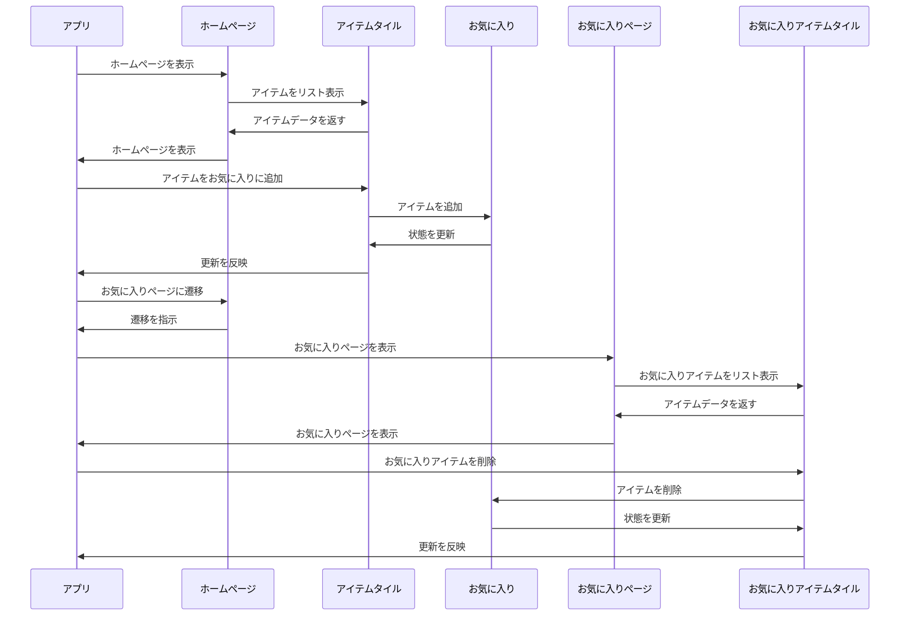

# シーケンス図

```mermaid
sequenceDiagram
    participant App as アプリ
    participant HomePage as ホームページ
    participant ItemTile as アイテムタイル
    participant Favorites as お気に入り
    participant FavoritesPage as お気に入りページ
    participant FavoriteItemTile as お気に入りアイテムタイル

    App->>HomePage: ホームページを表示
    HomePage->>ItemTile: アイテムをリスト表示
    ItemTile->>HomePage: アイテムデータを返す
    HomePage->>App: ホームページを表示
    App->>ItemTile: アイテムをお気に入りに追加
    ItemTile->>Favorites: アイテムを追加
    Favorites->>ItemTile: 状態を更新
    ItemTile->>App: 更新を反映
    App->>HomePage: お気に入りページに遷移
    HomePage->>App: 遷移を指示
    App->>FavoritesPage: お気に入りページを表示
    FavoritesPage->>FavoriteItemTile: お気に入りアイテムをリスト表示
    FavoriteItemTile->>FavoritesPage: アイテムデータを返す
    FavoritesPage->>App: お気に入りページを表示
    App->>FavoriteItemTile: お気に入りアイテムを削除
    FavoriteItemTile->>Favorites: アイテムを削除
    Favorites->>FavoriteItemTile: 状態を更新
    FavoriteItemTile->>App: 更新を反映
```