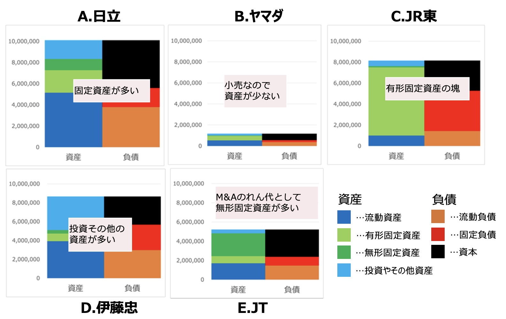

# 財務分析
下記のA社〜E社5社のバランスシート（単位は百万円）は日本の著名な上場企業の2020年3月期のものです。A社〜E社はそれぞれ日立製作所、JR東日本、伊藤忠商事、JT、ヤマダ電機の中のどの企業のものか当ててください。ほかと比べて資産の総量の大小を考察したり、総資産を100として各資産や負債の割合を元にした特徴を踏まえて考察するとよいでしょう。

---
A社
| 総資産 | 10,106,603 |
| ---- | ---- |
| 流動資産 | 5,151,800 |
| 有形固定資産 | 2,124,827 |
| 無形固定資産 | 1,054,370 |
| 投資その他資産 | 1,775,606 |
| 総負債資本 | 10,106,603 |
| ---- | ---- |
| 流動負債 | 3,795,394 |
| 固定負債 | 1,799,538 |
| 資本 | 4,511,671 |

B社
| 総資産 | 1,175,566 |
| ---- | ---- |
| 流動資産 | 538,676 |
| 有形固定資産 | 428,068 |
| 無形固定資産 | 40,287 |
| 投資その他資産 | 168,535 |
| 総負債資本 | 1,175,659 |
| ---- | ---- |
| 流動負債 | 379,539 |
| 固定負債 | 179,953 |
| 資本 | 616,167 |

C社
| 総資産 | 8,147,477 |
| ---- | ---- |
| 流動資産 | 1,003,376 |
| 有形固定資産 | 6,500,745 |
| 無形固定資産 | 112,499 |
| 投資その他資産 | 530,857 |
| 総負債資本 | 8,157,675 |
| ---- | ---- |
| 流動負債 | 1,434,356 |
| 固定負債 | 3,838,767 |
| 資本 | 2,884,552 |

D社
| 総資産 | 8,663,937 |
| ---- | ---- |
| 流動資産 | 3,923,361 |
| 有形固定資産 | 813,294 |
| 無形固定資産 | 362,571 |
| 投資その他資産 | 3,564,711 |
| 総負債資本 | 8,663,937 |
| ---- | ---- |
| 流動負債 | 2,988,902 |
| 固定負債 | 2,690,684 |
| 資本 | 2,984,351 |

E社
| 総資産 | 5,221,484 |
| ---- | ---- |
| 流動資産 | 1,707,767 |
| 有形固定資産 | 745,607 |
| 無形固定資産 | 2,370,385 |
| 投資その他資産 | 397,725 |
| 総負債資本 | 5,221,483 |
| ---- | ---- |
| 流動負債 | 1,478,623 |
| 固定負債 | 900,833 |
| 資本 | 2,842,027 |

## 答え

